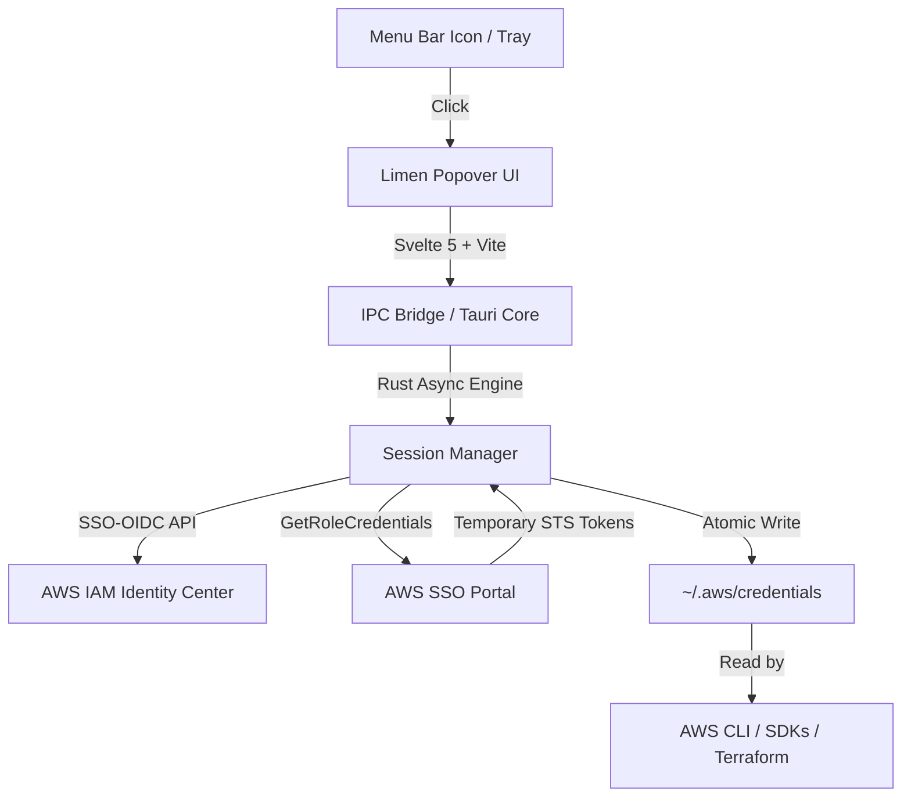

# Limen

[](https://github.com/ranajoy-dutta/limen/actions/workflows/ci.yml)
[](https://apple.com)
[](https://www.rust-lang.org/)
[](https://v2.tauri.app/)
[](https://svelte.dev/)
[](LICENSE)

**Limen** is an ultra-lightweight, native macOS menu bar switcher for **AWS IAM Identity Center (formerly AWS SSO)**. It provides frictionless authentication, role discovery, and instantaneous credential delivery directly into your standard `~/.aws/credentials` file.

Built with Rust and Svelte 5 on Tauri v2, Limen runs as a true macOS menu bar accessory (`LSUIElement`) with **zero Dock footprint** and a standalone distribution size under 8 MB.

---

## Key Features

- ⚡ **True Native Menu Bar App**: Lives entirely in the macOS menu bar status item. Never clutters the Dock or `Cmd + Tab` app switcher.
- 🔐 **Native AWS IAM Identity Center Flow**: Initiates device authorization via AWS SSO-OIDC and handles verification in the browser with one-click code copying.
- 🏢 **Multi-Account & Role Discovery**: Automatically enumerates all accessible AWS accounts and IAM roles for the active Identity Center directory.
- 🔍 **Instant Search**: Fuzzy search across accounts, account IDs, and role names in real time.
- 🔄 **Multiple Simultaneous Profiles**: Activate different roles into distinct profile names (e.g. `default`, `staging`, `prod`) simultaneously in `~/.aws/credentials`.
- 📋 **One-Click Export**: Copy `export AWS_PROFILE=<name>` shell snippets straight from the menu bar to target any terminal session immediately.
- ⏹️ **Independent Session Control**: Deactivate or stop individual profile sessions with a single click, or sign out entirely.
- 🚀 **Sub-10MB Memory & Binary**: Standalone native binary compiled to Apple Silicon (`aarch64`) with minimal memory overhead and zero Electron bloat.
- 🧪 **Offline Mock Mode**: Built-in mock authentication and account simulator for local UI testing and development without live AWS credentials.

---

## Architecture Overview



### Technology Stack
- **Engine**: [Rust](https://www.rust-lang.org/) (2021 edition) + [Tauri v2](https://v2.tauri.app/)
- **Frontend**: [Svelte 5](https://svelte.dev/) + [TypeScript](https://www.typescriptlang.org/) + [Vite](https://vitejs.dev/)
- **Native macOS Layer**: Cocoa / AppKit bindings via Objective-C runtime (`objc`) for borderless WebKit backdrop and tray event handling.
- **AWS Integration**: Official [AWS SDK for Rust](https://github.com/awslabs/aws-sdk-rust) (`aws-sdk-ssooidc`, `aws-sdk-sso`).

---

## Installation

### Option 1: Homebrew (Recommended)

Install via the official tap:

```bash
brew install --cask ranajoy-dutta/tap/limen
```

To update in the future:
```bash
brew upgrade --cask limen
```

---

### Option 2: Direct Download (DMG)

Download the latest `.dmg` release from [GitHub Releases](https://github.com/ranajoy-dutta/limen/releases):
1. Open `Limen_0.1.0_aarch64.dmg`.
2. Drag **Limen.app** into your `/Applications` folder.
3. Launch Limen from `/Applications` or Spotlight.

> **Note on macOS Gatekeeper:**
> For first launch on unnotarized builds, macOS may prompt a standard security notice.
> - **GUI**: Right-click `Limen.app` in Finder → Select **Open** → Click **Open**.
> - **CLI**: Run `xattr -cr /Applications/Limen.app` once.

---

## Usage

1. **Sign In**:
   - Enter your AWS IAM Identity Center **SSO Start URL** (e.g. `https://my-company.awsapps.com/start`) and **SSO Region** (e.g. `us-east-1`).
   - Click **Sign In with AWS SSO**.
   - Copy the displayed authorization code, click **Open Browser**, and authorize the session.
2. **Activate Credentials**:
   - Browse or search your AWS accounts.
   - Expand an account and click the **Play (▶)** button next to the desired role.
   - Limen fetches temporary STS credentials and writes them to `~/.aws/credentials`.
3. **Use with CLI / Tools**:
   - Click **export** next to any active profile to copy the shell command:
     ```bash
     export AWS_PROFILE=default
     aws sts get-caller-identity
     ```
4. **Context Menu & Quit**:
   - **Left-Click** menu bar icon: Toggles the Limen popover.
   - **Right-Click** menu bar icon: Opens the native macOS context menu with **Quit Limen** (`⌘Q`).
   - You can also click **Quit Limen** inside the popover footer.

---

## Development & Building from Source

### Prerequisites
- macOS 12+ (Apple Silicon or Intel)
- [Rust](https://rustup.rs/) (1.78+)
- [Node.js](https://nodejs.org/) (v18+) and `npm`

### Local Setup

1. **Clone the repository:**
   ```bash
   git clone https://github.com/your-org/limen.git
   cd limen
   ```

2. **Install frontend dependencies:**
   ```bash
   npm install
   ```

3. **Run in Development Mode (Live AWS SSO):**
   ```bash
   npm run tauri dev
   ```

4. **Run in Offline Mock Mode:**
   You can develop and test the entire UI flow without an AWS account using the built-in mock engine:
   ```bash
   LIMEN_MOCK_AUTH=1 npm run tauri dev
   ```

### Building the Production Bundle

To build the self-contained macOS `.app` bundle and standalone `.dmg` installer:
```bash
npm run build && npm run tauri build
```

The output artifacts will be placed in:
- App Bundle: `src-tauri/target/release/bundle/macos/Limen.app`
- DMG Installer: `src-tauri/target/release/bundle/dmg/Limen_0.1.0_aarch64.dmg`

---

## Security & Privacy Considerations

- **Zero Third-Party Telemetry**: Limen collects no analytics, telemetry, or user data.
- **Direct Delivery**: Credentials obtained from AWS SSO are written directly to your operating system's standard `~/.aws/credentials` file.
- **In-Memory OIDC Tokens**: Client tokens and registration state are managed in-process using scoped Rust memory structures.
- **Native Sandboxing**: Uses macOS WebKit sandbox without external network permissions outside of direct AWS endpoints.

---

## Contributing

Contributions are welcome! Please review [CONTRIBUTING.md](CONTRIBUTING.md) for details on our code of conduct, development standards, and pull request workflow.

---

## License

This project is licensed under the MIT License — see the [LICENSE](LICENSE) file for details.
